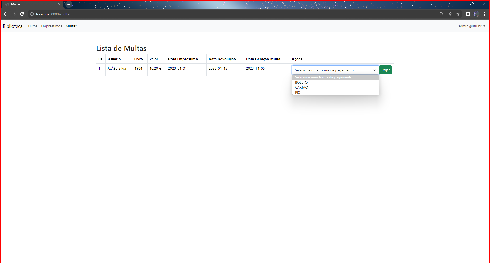

# Sistema de Gerenciamento de Biblioteca


## Introdução (Home)

Este sistema foi desenvolvido para gerenciar as operações cotidianas de uma biblioteca, incluindo o empréstimo e a devolução de livros, gerenciamento de usuários e a manutenção do catálogo de livros. Com o objetivo de modernizar e automatizar os processos de uma biblioteca, tornando uma melhor experiência para os usuários.

### Tela do Admin

Na Tela inicial (Livros), na visão do administrador.
Observe que o Administrador tem 2 opções a mais que um usuário comum, que é a opção de Editar (Onde o Admin pode alterar Qualquer informação do Livro em especifico), é a opção Deletar (Onde o Admin pode deletar aquele Livro em especifico).


Aqui observamos detalhadamente, a visao de como é feita a alteração do Livro, quando clicamos na opção de Editar, em um Livro em especifico, monstra todos os detalhes dele, e que pode-se alterar qualquer informação deste Livro.


Na Tela de Emprestimo, na visão do administrador.
Observe que o Administrador tem 2 opções a mais que um usuário comum, que é a opção de Editar (Onde o Admin pode alterar as Datas, dentre outras informaçoes sobre o Emprestimo), é a opção de Deletar (Onde o Admin pode deletar aquele Emprestimo em especifico).


Aqui observamos detalhadamente, a visao de como é feita a alteração dos emprestimos, informação que pode ser alterada quando a opção de Editar e acionada.


Na Tela de Multas, na visão do Administrador não tem muitas diferenças do que na visão do usuario comum, porém na visão do administrador, mostra as multas de TODOS os Usuario, no caso da visão do usuario mostra apenas a multa dele, caso tenha alguma multa.


Aqui mostra as opção que pode ser selecionadas para pagar a multa.


Quando logado no admin, em sua visao quando clicado em seu nome de usuario, ele demonsta uma opção a mais que um usuario comum que e a opção de Usuarios, em que nesta opção mostra TODOS os usuario registrado.


Na Tela Usuarios, que e uma janela unica do admin, mostra todos os usuarios registrado, o admin tem 2 opções em cada usuario, em que uma delas e o Editar onde o admin pode alterar qualquer informações do usuario, é o Deletar onde o admin pode excluir o usuario.


Aqui mostra os detalhes do funcionamento da opção de Editar do admin, em que ele pode editar qualquer informação daquele usuario em especifico.


### Tela do Usuarios

Na Tela inicial (Livros), na visão do Usuario.
Observe que o Usuario não tem as 3 opções como no Admin, so possui a opção de Emprestar, em que nesta pagina mostra varios Livros que o usuario pode escolher para pegar emprestado. Porém, o usuario so ira conseguir realizar o emprestimo com sucesso se o livro estiver disponivel, ou seja, se a quantidade dele nao estiver sido esgotada.


Na Tela Emprestimo, na visão do Usuario. Ele possui a opção de devolver o Livro que ele pegou emprestado. Caso ele devolva o livro apos o vencimento de seu emprestimo, ou seja, quando ele ultrapassa o tempo limite para devolver o livro, ele tera que pagar uma multa.


Na Tela Emprestimo, na visão do Usuario. Mostrara apenas a multa que o usuario possui, ele pode ter varias multas ou nenhuma multa. Caso tenha multa apareçera o valor da multa, e as informações do Livro que ele levou multa.


Aqui mostra as opções que o usuario possui para poder pagar esta multa.


Aqui diferente da visão do Admin que pode ver outros usuarios registrados, o usuario so tem a opção de deslogar de sua conta.


### Tela do Bando De Dados Do Projeto

Tela Geral Do Sistema do Banco de Dados do Projeto


Aqui vemos as consultas dos Emprestimo


Aqui vemos as consultas dos Livros


Aqui vemos as consultas de Multas, que neste caso nao tem nenhuma pois o print e de antes de fazemos os testes de multa.


Aqui vemos as consultas dos Usuario


## Padrões de Projeto

### Singleton
Aplicado na classe `BibliotecaService` para garantir uma única instância desta classe durante toda a execução do sistema, proporcionando um ponto global de acesso a este objeto. O Singleton é um padrão de projeto de software que garante que uma classe tenha apenas uma instância e fornece um ponto de acesso global a essa instância. Isso é útil quando você deseja ter um único ponto de controle para uma determinada funcionalidade ou recurso.

```java
public class BibliotecaService {
    private static BibliotecaService instance;
    
    private BibliotecaService() { }
    
    public static synchronized BibliotecaService getInstance() {
        if (instance == null) {
            instance = new BibliotecaService();
        }
        return instance;
    }
}
```

### Factory
Utilizado para criar objetos de `Usuario` e `Emprestimo` de forma encapsulada, permitindo a criação de diferentes tipos de usuários e empréstimos baseado nas regras de negócio. O padrão Factory é um padrão de criação que fornece uma interface para criar objetos em uma superclasse, mas permite que as subclasses decidam qual classe concreta criar. Isso promove o princípio de abstração e encapsulamento, tornando o código mais flexível e menos acoplado.

```java
public abstract class FabricaDeUsuario {
    public abstract Usuario criarUsuario(String nome, String email, String senha);
}
```

### Decorator
Usado para aplicar a multa ou desconto no pagamento do emprestimo do livro. O padrão Decorator é um padrão estrutural que permite adicionar comportamento adicional a objetos existentes dinamicamente, sem modificar sua estrutura. Isso é alcançado por meio da composição de objetos em uma cadeia, onde cada objeto decora o próximo.

### Proxy
Usado no pacote security, no processo de autenticação do usuário. O padrão Proxy é um padrão estrutural que atua como um substituto para outro objeto para controlar o acesso a ele. É útil em situações em que você deseja adicionar comportamento adicional, como controle de acesso, a um objeto existente.

### Strategy
Usado para definir o tipo de pagamento do emprestimo do livro (Pix, Cartão, Boleto). O padrão Strategy é um padrão comportamental que define uma família de algoritmos, encapsula cada um deles e os torna intercambiáveis. Isso permite que o cliente escolha o algoritmo a ser usado em tempo de execução.

### Template
Usado na classe de Emprestimo. O padrão Template é um padrão comportamental que define a estrutura de um algoritmo, permitindo que partes específicas desse algoritmo sejam implementadas por subclasses. Isso promove a reutilização de código e permite que as subclasses personalizem o comportamento conforme necessário.


## Princípios de Projeto

### SRP (Single Responsibility Principle)
Cada classe no sistema tem uma única responsabilidade. Por exemplo, a classe `UsuarioService` é responsável apenas por operações relacionadas ao gerenciamento de usuários. O SRP é um dos princípios do SOLID e afirma que uma classe deve ter apenas uma razão para mudar, ou seja, deve ter uma única responsabilidade. Isso ajuda a manter o código mais organizado, coeso e fácil de manter

```java
@Service
public class UsuarioService {
    public Usuario findById(Long id) { /* ... */ }
    public void saveUsuario(Usuario usuario) { /* ... */ }
}
```

### OCP (Open/Closed Principle)
O sistema foi projetado para ser extensível sem a necessidade de modificar o código existente. Por exemplo, novos tipos de `Emprestimo` podem ser criados e utilizados sem alterar o código existente. O OCP é outro princípio do SOLID que afirma que as entidades de software (classes, módulos, funções, etc.) devem estar abertas para extensão, mas fechadas para modificação. Isso significa que você pode estender o comportamento de uma entidade sem precisar alterar seu código-fonte.

```java
public abstract class Emprestimo {
    public abstract void defineDatas();
}
```

### Inversão de dependência
Princípio gerado automaticamente pelo Spring. A inversão de dependência é um princípio que afirma que as classes de alto nível não devem depender das classes de baixo nível, mas ambas devem depender de abstrações. Isso promove a flexibilidade e a capacidade de alterar as implementações sem afetar as classes de alto nível.

## Framework (Opcional)
Um framework é um conjunto de bibliotecas, padrões e diretrizes que fornecem uma estrutura para desenvolver software. Ele geralmente inclui funcionalidades comuns e abstrações que facilitam o desenvolvimento de aplicativos e sistemas, economizando tempo e esforço dos desenvolvedores. Frameworks podem ser usados para criar aplicativos web, aplicativos móveis, jogos, entre outros.

### Spring Framework
Optamos pelo Spring Framework devido à sua vasta comunidade, documentação robusta e facilidade de integração com outras tecnologias. Ele é utilizado extensivamente ao longo do projeto, por exemplo, na injeção de dependências.

```java
@Autowired
private UsuarioService usuarioService;
```

- **Vantagens**: Facilita a configuração e a modularidade do projeto, além de proporcionar uma vasta gama de funcionalidades através de seus módulos, garante a inversão de dependência dentro do projeto.

- **Desvantagens**: A curva de aprendizado pode ser íngreme para desenvolvedores menos experientes e a configuração inicial pode ser complexa, torna a legibilidade do codigo mais complexa visto o uso de uma sintaxe mais complexa que a do proprio java.

## Conclusão

Durante o desenvolvimento deste projeto, aprendemos a usar na pratica os princípios e padrões de design de software para construir um sistema modular, extensível e de fácil manutenção. Algumas dificuldades incluíram a configuração inicial do framework e o entendimento de alguns padrões de design mais complexos na hora de por em pratica o conceito. No entanto, a aplicação prática desses conceitos resultou em um software funcional que atende às necessidades de gerenciamento de uma biblioteca.

---

## Autores

 - Guilherme Castilho Machado    - 12021BSI225
 - Lucas Gabriel Dutra de Souza  - 12121BSI226
 - Victor Ricarte Silva          - 12021BSI230
 - Vitória Silva Cardoso         - 11921BSI217
